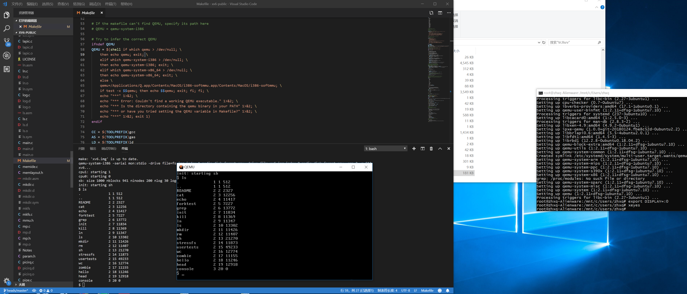

# xv6windows
Run xv6 on Windows, manual by Xiangqun Zhang (zhxq).

You know what? Run xv6 is not a hard thing on Windows - since Windows is now supporting Windows Subsystem for Linux, it is possible to run Linux app on Windows. Though I believe there is a way to run QEMU and xv6 directly on Windows using mingw or other compilers, I believe it would be a less hassle if use WSL.

## What is WSL?
WSL is actually a Linux runtime on Windows, which started not very long ago. It added a Linux runtime on Windows so that people can just run most Linux softwares on Windows, without using Virtual Machines; therefore, WSL provided a great integration for Linux runtime on Windows, and better performance than traditional VMs. 

In fact, for years, people were trying to run things inversely - write Windows runtime on Linux (or other Unix/Unix-Like systems), and that is what we call "Wine", which stands for "Wine Is Not a Emulator". Since this is not supported by Microsoft, there are tons of problems with compatibilities. However, WSL is officially supported by Microsoft and several Linux distributions, so the performance on WSL is just great - not so many hassles comparing Wine. If there is anything I would like to complain about WSL, then that will be the limitation of not able to run 64 bit softwares on WSL. However, since QEMU does not require 64 bits support (and neither xv6) to work, this is not a problem for this project.

## Enough story, how to run xv6 on WSL?
OK, enough mumble jumble. Here is the thing.

### Install WSL
First, you need to install WSL. Here is the guide for that: https://docs.microsoft.com/en-us/windows/wsl/install-win10.

In case you cannot find **PowerShell**: it can be started by right clicking the Windows button on your start menu, and select **PowerShell (run as administrator)**, then input the lines mentioned in the link above.

For the distribution, I prefer Ubuntu, and I suggest you to use Ubuntu here so that you will not encounter any strange problems.

You need to reboot your computer when prompted.

### Install qemu on WSL

Congrats! You've finished your first step. Now you can run most Command Line Interface (CLI) based 32 bits Linux softwares on WSL. I will talk about how to get Graphic User Interface (GUI) work in the next part. 

Now, press Win+R to open a "Run" dialog box, and input "bash" and press Enter. If that did not work, try input "ubuntu" if you chose Ubuntu in the last step, then press enter. You will now see a beautiful black-and-white command line prompt window, and that is the shell for WSL.

Just like you would usually do with Ubuntu, you will want to install softwares. Everything will be similar to the real Ubuntu command line (since it is actually a real Ubuntu runtime).

First, update your repo info using **sudo apt update**. After that, run **sudo apt upgrade**, and then run **sudo apt install build-essential qemu** (This is for installing building environments and qemu itself). Confirm and wait for it - this will take some time. You can read the next part during this time - that is multitasking!

### Install VcXsrv (or other X env) on Windows

This is for X compatibility. As I said, WSL does not ship with GUI support, so you need to use something to run GUI for WSL. Since QEMU requires X Window Environment to run (and there is no X support on Windows), you need to install VcXsrv or other X environment (e.g.: Xming) on Windows so you can run GUI on WSL. I used VcXsrv and it worked fine (not sure about others though). VcXsrv can be found at: https://sourceforge.net/projects/vcxsrv/.

After you install this, you should get two new icons on Windows Desktop, and one of them should be **XLaunch**. Run it, for the first dialog box (Select display settings), choose "Multiple Windows", then click "Next". For the second dialog box (Select how to start clients), choose "Start no client". For the third dialog box, just click "Next". Lastly at the confirmation page, click "Finish". The dialog box will disappear, and it will work on background. You can find the X icon on your Start menu tray.

### Run xv6

For the last step, we need to tell the WSL where the "Display" is. This can be done by running **export DISPLAY=:0**  on WSL shell. 

And everything should be same as in a normal Ubuntu environment. Use WSL bash and change directory to your xv6 directory, and run **make && make qemu**. If you have did everything correctly, you should be able to see a successful make process, and a qemu window jumps out. You can still use the original WSL shell for inputing xv6 command lines if you want - as I said, it is now basically the same as a standard Ubuntu.

### Recap

First, install WSL.

Second, install build env and qemu on WSL.

Third, Install VcXsrv on Windows.

Lastly, just run xv6 as you are in Ubuntu.

If you have any questions, please consult me at *davidzhang#nyu.edu*. If you liked this, please consider giving me a star. Thanks!
